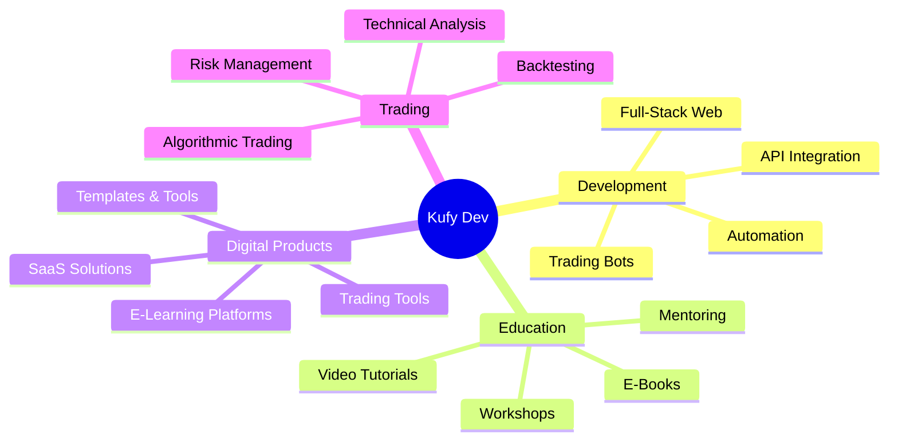

<div align="center">

# 👋 Welcome to Kufy's Digital Lab

```ascii
 ██╗  ██╗██╗   ██╗███████╗██╗   ██╗    ██████╗ ███████╗██╗   ██╗
 ██║ ██╔╝██║   ██║██╔════╝╚██╗ ██╔╝    ██╔══██╗██╔════╝██║   ██║
 █████╔╝ ██║   ██║█████╗   ╚████╔╝     ██║  ██║█████╗  ██║   ██║
 ██╔═██╗ ██║   ██║██╔══╝    ╚██╔╝      ██║  ██║██╔══╝  ╚██╗ ██╔╝
 ██║  ██╗╚██████╔╝██║        ██║       ██████╔╝███████╗ ╚████╔╝ 
 ╚═╝  ╚═╝ ╚═════╝ ╚═╝        ╚═╝       ╚═════╝ ╚══════╝  ╚═══╝  
```


[](https://github.com/kufy-dev)
[](https://github.com/kufy-dev)

</div>

---

## 👨‍💻 Terminal Access: Granted

```bash
kufy@dev:~$ whoami
> Multi-domain Developer | Educator | Digital Product Creator 🚀

kufy@dev:~$ current_status
> 🟢 Building: E-learning platforms & trading tools
> 🟡 Teaching: Web development & software engineering
> 🔵 Creating: Digital products that solve real problems
> ☕ Coffee: Level critical (as always)

kufy@dev:~$ cat mission.txt
> "Building digital solutions, sharing knowledge,
>  and making technology accessible for everyone"

kufy@dev:~$ ls projects/
> trading-bots/        web-apps/           e-learning/
> digital-products/    open-source/        tutorials/
> automation-tools/    saas-projects/      e-books/

kufy@dev:~$ cat expertise.json
{
  "development": ["Full-Stack", "Web Apps", "Trading Bots", "Automation"],
  "education": ["Software Engineering", "Web Dev", "Trading Strategies"],
  "products": ["E-Books", "SaaS", "Digital Tools", "Educational Content"],
  "mission": "Code • Teach • Build • Share"
}
```

---

<div align="center">

## 🎯 What I Do

<table>
<tr>
<td align="center" width="25%">

<h3>💻 Development</h3>
<p>Building web applications, trading bots, and automation tools</p>
</td>
<td align="center" width="25%">

<h3>📚 Education</h3>
<p>Teaching software development & creating learning content</p>
</td>
<td align="center" width="25%">

<h3>🚀 Products</h3>
<p>Creating digital products & SaaS solutions</p>
</td>
<td align="center" width="25%">

<h3>📊 Trading</h3>
<p>Developing algorithmic trading strategies & tools</p>
</td>
</tr>
</table>

</div>

---

<div align="center">

## 🛠️ Tech Stack & Tools

### Frontend Development


### Backend Development


### Database & Storage


### Trading & Finance


### Data Science & Analysis


### DevOps & Tools


### Design & Content Creation


</div>

---


<div align="center">

## 🏆 GitHub Trophies


</div>

---

## 💼 What I'm Building

```python
class KufyDev:
    def __init__(self):
        self.name = "Kufy Dev"
        self.roles = [
            "Full-Stack Developer",
            "Tech Educator", 
            "Digital Product Creator",
            "Trading Bot Developer"
        ]
        self.languages = ["Python", "JavaScript", "HTML/CSS"]
        self.currently_learning = ["AI/ML", "Cloud Architecture", "Advanced Trading Strategies"]
        
    def current_projects(self):
        return {
            "🌐 Web Development": [
                "E-learning platforms",
                "SaaS applications",
                "Portfolio websites",
                "Business automation tools"
            ],
            "🤖 Trading & Automation": [
                "Algorithmic trading bots",
                "Market analysis tools",
                "Backtesting frameworks",
                "Risk management systems"
            ],
            "📚 Educational Content": [
                "Interactive e-books",
                "Video tutorials",
                "Coding bootcamp materials",
                "Tech documentation"
            ],
            "🚀 Digital Products": [
                "Productivity tools",
                "Trading guides",
                "Web templates",
                "API integrations"
            ]
        }
    
    def teaching_topics(self):
        return [
            "💻 Web Development (Frontend & Backend)",
            "🐍 Python Programming",
            "📊 Data Analysis & Visualization",
            "🤖 Trading Bot Development",
            "🎨 UI/UX Design Principles",
            "📈 Technical Analysis & Trading"
        ]
    
    def daily_routine(self):
        return {
            "06:00": "☕ Coffee + Market analysis",
            "08:00": "💻 Development & coding",
            "12:00": "📚 Content creation & teaching",
            "15:00": "🔧 Product development",
            "18:00": "📖 Learning & research",
            "21:00": "🤝 Community engagement",
            "23:00": "📊 Trading bot monitoring",
            "03:00": "👀 (Sometimes checking charts... again)"
        }
    
    def philosophy(self):
        return """
        🎯 Build solutions that matter
        📚 Share knowledge freely
        🚀 Ship products that help people
        💡 Never stop learning
        🤝 Grow together with the community
        """

me = KufyDev()
print(me.philosophy())
```

---

<div align="center">

## 🎓 Teaching & Education

### 📖 Topics I Teach

<table>
<tr>
<td align="center" width="33%">

<h4>Web Development</h4>
<p>HTML, CSS, JavaScript<br>React, Node.js, APIs</p>
</td>
<td align="center" width="33%">

<h4>Python Programming</h4>
<p>Basics to Advanced<br>Data Analysis, Automation</p>
</td>
<td align="center" width="33%">

<h4>UI/UX Design</h4>
<p>Design Principles<br>Figma, Responsive Design</p>
</td>
</tr>
<tr>
<td align="center" width="33%">

<h4>Trading Bots</h4>
<p>Algorithmic Trading<br>Bot Development, Backtesting</p>
</td>
<td align="center" width="33%">

<h4>Database Management</h4>
<p>SQL, NoSQL<br>MongoDB, PostgreSQL</p>
</td>
<td align="center" width="33%">

<h4>API Development</h4>
<p>RESTful APIs<br>Authentication, Integration</p>
</td>
</tr>
</table>

### 📊 Educational Content Stats

| Content Type | Status | Reach |
|--------------|--------|-------|
| 📚 **E-Books** |  | Educational guides |
| 🎥 **Tutorials** |  | Video content |
| 📝 **Articles** |  | Tech blogs |
| 💬 **Mentoring** |  | 1-on-1 sessions |

</div>

---

<div align="center">

## 🚀 Digital Products

### 💎 Products I've Built

| Product | Category | Status |
|---------|----------|--------|
| 📊 **Trading E-Book** | Education | ✅ Live |
| 🤖 **Crypto Bot Framework** | Trading | ✅ Live |
| 🌐 **Portfolio Template** | Web Design | ✅ Live |
| 📚 **Learning Platform** | SaaS | 🚧 In Progress |
| 🔧 **Automation Tools** | Productivity | ✅ Live |
| 💹 **Market Analysis Dashboard** | Trading | 🚧 In Progress |

</div>

---

<div align="center">

## 🎯 Focus Areas & Expertise



</div>

---

<div align="center">

## 📊 Activity Graph


</div>

---

<div align="center">

## 💡 Random Dev Quote


</div>

---

<div align="center">

## 🤝 Connect & Collaborate

[](https://github.com/kufy-dev)
[](https://www.youtube.com/@init_l-q7h)
[](https://x.com/kufy587)
[](https://www.instagram.com/init_l_/)
[](https://www.tiktok.com/@init_l)
[](mailto:lutfimaulana556@gmail.com)
[](https://linkedin.com/in/kufy-dev)
[](https://t.me/kufy_dev)

### 💬 Let's Talk About

```
💻 Web Development Projects
📚 Teaching & Mentoring
🤝 Collaboration Opportunities
🚀 Product Ideas
📊 Trading Strategies
🎯 Freelance Work
```

</div>

---

<div align="center">

## 🎮 When I'm Not Coding

<table>
<tr>
<td align="center" width="25%">

<h4>📚 Learning</h4>
<p>New tech & strategies</p>
</td>
<td align="center" width="25%">

<h4>🎥 Creating</h4>
<p>Educational content</p>
</td>
<td align="center" width="25%">

<h4>☕ Coffee</h4>
<p>Brewing & enjoying</p>
</td>
<td align="center" width="25%">

<h4>🤝 Community</h4>
<p>Helping others grow</p>
</td>
</tr>
</table>

</div>

---

<div align="center">

## 📈 Professional Services

### 🔧 What I Can Help You With

| Service | Description | Status |
|---------|-------------|--------|
| 🌐 **Web Development** | Full-stack web applications, responsive design | ✅ Available |
| 🤖 **Trading Bot Development** | Custom trading algorithms & automation | ✅ Available |
| 📚 **Tech Mentoring** | 1-on-1 coaching, code reviews, career guidance | ✅ Available |
| 🎨 **UI/UX Design** | Modern, user-friendly interface design | ✅ Available |
| 🔌 **API Integration** | Third-party services, payment gateways | ✅ Available |
| 📊 **Data Analysis** | Market analysis, data visualization | ✅ Available |

**Interested in working together?** [Let's connect!](mailto:lutfimaulana556@gmail.com)

</div>

---

<div align="center">

## ⚠️ Important Notes

> **💼 Professional Work:** Available for freelance projects & consultations  
> **📚 Educational Content:** Free resources available on my GitHub  
> **🤖 Trading Disclaimer:** All trading tools are for educational purposes  
> **🤝 Open Source:** Many projects are open for contributions

</div>

---

<div align="center">

### 💚 Support My Work

If you find my projects helpful:

[](https://buymeacoffee.com/kufydev)
[](https://ko-fi.com/kufydev)
[](https://github.com/sponsors/kufy-dev)
[](https://paypal.me/lutfimaulana556)

</div>

---

<div align="center">

## 📈 Profile Summary


</div>

---

**⭐ Star repositories you find useful • 🍴 Fork projects you want to contribute to**

<sub>Made with 💚, lots of ☕, and endless curiosity by Kufy Dev</sub>

</div>
