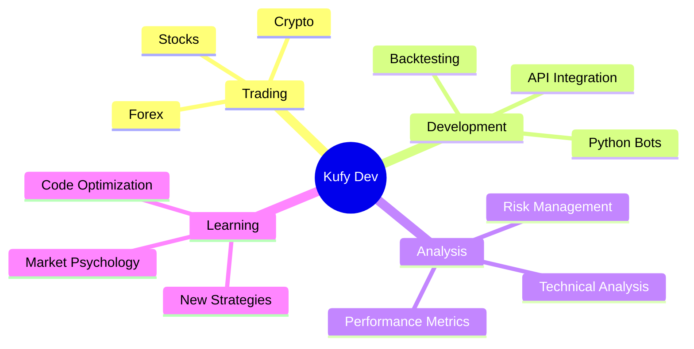

<div align="center">

# 👋 Welcome to Kufy's Terminal

```ascii
 ██╗  ██╗██╗   ██╗███████╗██╗   ██╗    ██████╗ ███████╗██╗   ██╗
 ██║ ██╔╝██║   ██║██╔════╝╚██╗ ██╔╝    ██╔══██╗██╔════╝██║   ██║
 █████╔╝ ██║   ██║█████╗   ╚████╔╝     ██║  ██║█████╗  ██║   ██║
 ██╔═██╗ ██║   ██║██╔══╝    ╚██╔╝      ██║  ██║██╔══╝  ╚██╗ ██╔╝
 ██║  ██╗╚██████╔╝██║        ██║       ██████╔╝███████╗ ╚████╔╝ 
 ╚═╝  ╚═╝ ╚═════╝ ╚═╝        ╚═╝       ╚═════╝ ╚══════╝  ╚═══╝  
```


[](https://github.com/kufy-dev)
[](https://github.com/kufy-dev)

</div>

---

## 👨‍💻 Terminal Access: Granted

```bash
kufy@dev:~$ whoami
> A guy who thinks he can outsmart the market with Python 🐍

kufy@dev:~$ current_status
> 🔴 ERROR: Strategy failed successfully.
> 🟢 SUCCESS: Coffee level critical ☕
> 🟡 WARNING: Staring at charts again at 3 AM 📊

kufy@dev:~$ cat goals.txt
> 1. Build the perfect trading bot
> 2. Stop revenge trading (work in progress...)
> 3. Refactor spaghetti code
> 4. Actually get some sleep

kufy@dev:~$ ls projects/
> trading-bots/     crypto-tools/     market-analysis/
> backtesting/      portfolio-mgmt/   e-books/

kufy@dev:~$ echo $MOOD
> "In code we trust, in backtest we verify 📈"
```

---

<div align="center">

## 🛠️ Tech Stack & Tools

### Languages & Frameworks


### Trading & Finance


### Data & Analytics


### Tools & Platform


</div>

---

<div align="center">

## 📊 GitHub Statistics


</div>

---

<div align="center">

## 🔥 Contribution Streak


</div>

---

<div align="center">

## 🏆 GitHub Trophies


</div>

---

<div align="center">

## 📈 Trading Bot Status

| Metric | Status | Performance |
|--------|--------|-------------|
| **Bot Status** |  | Running 24/7 |
| **Win Rate** |  | (It's honest work) |
| **Profit** |  | Still optimizing... |
| **Coffee/Day** |  | ☕☕☕☕☕ |
| **Code Quality** |  | Refactor pending |

</div>

---

<div align="center">

## 📂 Featured Projects

<a href="https://github.com/kufy-dev/trading-stockity-ebook">
  
</a>

<a href="https://github.com/kufy-dev/crypto-trading-bot">
  
</a>

</div>

---

<div align="center">

## 📊 Activity Graph


</div>

---

## 💼 What I'm Working On

```python
class KufyDev:
    def __init__(self):
        self.name = "Kufy Dev"
        self.role = "Trading Bot Developer"
        self.language_spoken = ["id_ID", "en_US"]
        
    def say_hi(self):
        print("Thanks for dropping by! Let's build something cool together 🚀")
        
    def current_projects(self):
        return [
            "📊 Building automated trading strategies",
            "🤖 Developing crypto trading bots",
            "📚 Creating trading educational content",
            "🔍 Backtesting and optimization tools",
            "💹 Market analysis automation"
        ]
    
    def daily_routine(self):
        return {
            "morning": "☕ Coffee + Check markets",
            "afternoon": "💻 Code trading bots",
            "evening": "📊 Backtest strategies",
            "night": "😴 Dream about profitable trades",
            "3am": "👀 Wake up to check charts (again)"
        }

me = KufyDev()
me.say_hi()
```

---

<div align="center">

## 🎯 Focus Areas



</div>

---

<div align="center">

## 🤝 Connect With Me

[](https://github.com/kufy-dev)
[](https://linkedin.com/in/kufy-dev)
[](https://twitter.com/kufy_dev)
[](mailto:your.email@example.com)
[](https://t.me/kufy_dev)

</div>

---

<div align="center">

## 💡 Random Dev Quote


</div>

---

<div align="center">

## 🎮 When I'm Not Coding

```
  🎯 Trading (or pretending to)
  📚 Reading about new strategies
  ☕ Making the perfect coffee
  🎵 Listening to lo-fi beats
  🏃 Running away from bugs
  💤 Sleeping (rarely)
```

</div>

---

<div align="center">

## ⚠️ Disclaimer

> **Trading involves substantial risk of loss.**  
> My bots are for educational purposes. Do your own research (DYOR).  
> Not financial advice. Trade at your own risk.

</div>

---

<div align="center">

### 💚 Support My Work

If you find my projects helpful, consider:

[](https://buymeacoffee.com/kufydev)
[](https://ko-fi.com/kufydev)
[](https://github.com/sponsors/kufy-dev)

</div>

---

<div align="center">

## 📈 Profile Summary


</div>

---

<div align="center">

### 🚀 "In code we trust, in backtest we verify"


<sub>Made with 💚 and lots of ☕ by Kufy Dev</sub>

</div>

---

<div align="center">

```
 _____                    _                                 _ _             
|_   _|                  | |                               | (_)            
  | |  _ __   ___  _ __  | |_ ___  __   ___   _   _ _ __ | |_ _ __   __ _ 
  | | | '_ \ / _ \| '__| | __/ _ \ \ \ / / | | | | | '_ \| | | '_ \ / _` |
  | | | | | |  __/| |    | || (_) | \ V /| |_| | | | | | | | | | | | (_| |
  \_/ |_| |_|\___||_|     \__\___/   \_/  \__, | |_|_| |_|_|_|_| |_|\__, |
                                            __/ |                     __/ |
                                           |___/                     |___/ 
```

**⭐ Star my repositories if you find them useful!**

</div>
